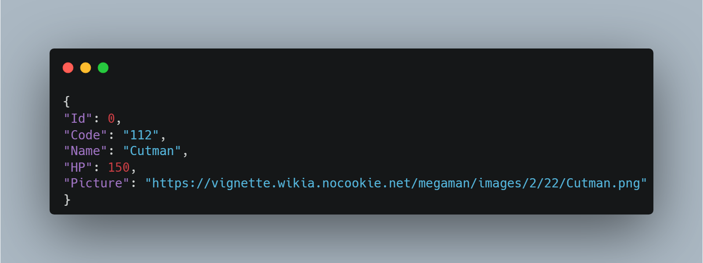

# 📌 MegaMan Boss API

## 📖 Visão Geral
MegaMan Boss API é um projeto desenvolvido em **.NET Core 3.1** que fornece informações sobre os chefes da franquia MegaMan. Ele disponibiliza dados em formato JSON, permitindo integração com outras aplicações.

---
## 📌 Formato de Resposta JSON
```json
{
    "Id": 0,
    "Code": "112",
    "Name": "Cutman",
    "HP": 150,
    "Picture": "https://vignette.wikia.nocookie.net/megaman/images/2/22/Cutman.png"
}
```


---
## 🛠️ Tecnologias Utilizadas
| Tecnologia | Versão |
|------------|---------|
| [.NET Core](https://dotnet.microsoft.com/en-us/) | 3.1 |
| [Entity Framework Core](https://docs.microsoft.com/en-us/ef/core/) | 3.1.8 |
| [SQL Server](https://www.microsoft.com/en-us/sql-server) | - |
| [Newtonsoft.Json](https://www.newtonsoft.com/json) | 12.0.2 |

---
## 📂 Estrutura do Projeto
```
.vs
.vscode
bin
Controllers
Database
middlewares
Models
obj
Properties
Services
appsettings.Development.json
appsettings.json
global.json
MegamanApi.csproj
MegamanApi.sln
Program.cs
Read-me_strool.md
Startup.cs
```

---
## 🚀 Como Executar o Projeto
1. Clone o repositório:
   ```sh
   git clone <URL_DO_REPOSITORIO>
   ```
2. Acesse o diretório do projeto:
   ```sh
   cd MegaManBossAPI
   ```
3. Restaure as dependências:
   ```sh
   dotnet restore
   ```
4. Execute a aplicação:
   ```sh
   dotnet run
   ```

---
## 🔥 Endpoints Disponíveis
| Método | Endpoint | Descrição |
|--------|---------|-----------|
| **GET** | `/api/v1/robots` | Retorna a lista de todos os robôs cadastrados. |
| **GET** | `/api/v1/robots/{id}` | Retorna um robô específico pelo ID. |
| **POST** | `/api/v1/robots` | Adiciona um novo robô à base de dados. |

---
## 📌 Implementação dos Endpoints
```csharp
[ApiController]
[Route("api/v1/robots")]
public class RobotsController : ControllerBase
{
    private readonly IRobotServices _services;
    public RobotsController(IRobotServices services)
    {
       _services = services;
    }

    [HttpGet] 
    public ActionResult<IEnumerable<RobotReadDTO>> GetAllRobots()
    {
        var robotItems = _services.SearchAll();
        return Ok(robotItems);
    }

    [HttpGet]
    [Route("{id:int}")]
    public object GetCommandById([FromRoute]int id)
    {   
        var robot = _services.SearchById(id);

        if(robot != null)
            return Ok(robot);
        
        return NotFound(new { message = "Nenhum robô encontrado" });
    }

    [HttpPost]
    public ActionResult RobotSend()
    {
        return Ok();
    }
}
```

---
## 🧩 Técnicas Utilizadas
- **Arquitetura MVC**: Separação das camadas Controllers, Models e Services.
- **Injeção de Dependência**: Uso do `IRobotServices` para gerenciar dados.
- **Entity Framework Core**: Para comunicação com o banco de dados.
- **Serialização com Newtonsoft.Json**: Para formatação dos dados em JSON.

---
## 📦 Dependências Utilizadas
| Dependência | Versão |
|------------|---------|
| [Microsoft.EntityFrameworkCore](https://www.nuget.org/packages/Microsoft.EntityFrameworkCore/) | 3.1.8 |
| [Microsoft.EntityFrameworkCore.Design](https://www.nuget.org/packages/Microsoft.EntityFrameworkCore.Design/) | 3.1.8 |
| [Microsoft.EntityFrameworkCore.SqlServer](https://www.nuget.org/packages/Microsoft.EntityFrameworkCore.SqlServer/) | 3.1.8 |
| [Newtonsoft.Json](https://www.nuget.org/packages/Newtonsoft.Json/) | 12.0.2 |

---
## 📬 Contato
Caso tenha dúvidas ou sugestões, entre em contato pelo e-mail: [connorstrool@gmail.com](mailto:connorstrool@gmail.com).


